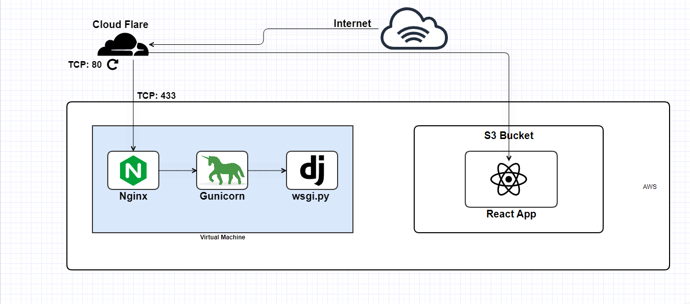

# Jobs Portal
This repository contains the source code for the Jobs Portal application

### components
- [Backend](/backend/) (Django Rest Framework)
- [Frontend](/frontend/) (React)

### AWS Architecture

## Author
[kallyas](https://github.com/kallyas)

## License
[MIT](/LICENSE)
